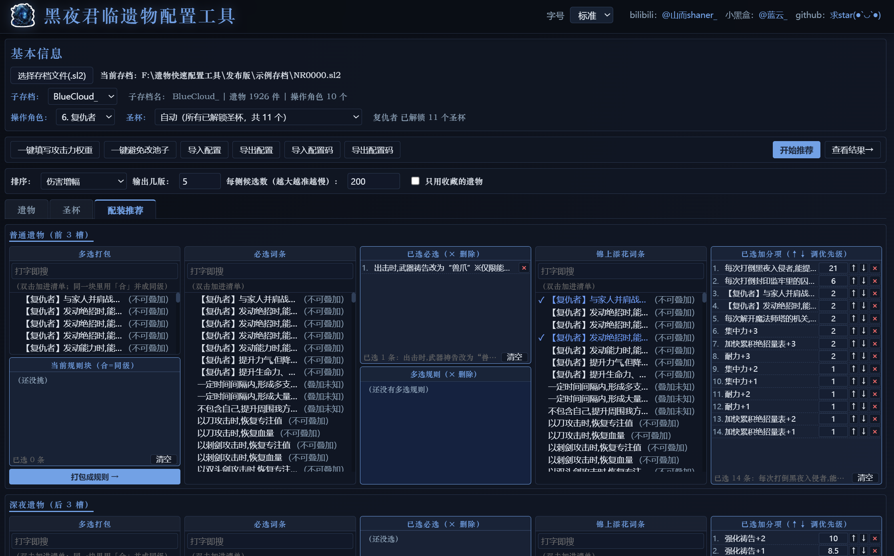
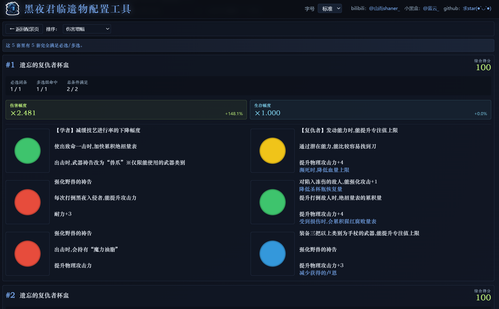

# 遗物快速配置工具 · 使用说明

一个《艾尔登法环：黑夜君临》的**配装推荐**工具。

- 只**读取**你的存档，**不会修改**存档，放心用。
- 打包成了单个 exe，**无需装 Python**。
- 源码 / 更新日志：<https://github.com/BlueWhiteCloud/nightreign-relic-build-tool>
- 下载地址：<https://github.com/BlueWhiteCloud/nightreign-relic-build-tool/releases/latest>，点击 zip 压缩包下载解压即可。
- 觉得好用的话，可以帮忙点个免费的 ⭐ 支持一下吗(●'◡'●)

---

## 预览

**配置页**（在这一页设条件）



**结果页**（在这一页看推荐结果）



---

## 一、简要功能

输入：一个`.sl2`存档文件（当前在用/备份的游戏存档均可，只读）+ 规则条件（可导入）

输出：展示当前.sl2在设定条件下得分最高的前n套遗物

---

## 二、快速上手

1. **选择存档文件(.sl2)** → 选 `示例存档\NR0000.sl2`。
2. **子存档** → 选 BlueCloud_。
3. 切到 **配装推荐**页。
4. **导入配置** → 选 `预设配置\复仇者\兽爪蜗配装配置.json`。
5. 点 **开始推荐**，耐心等待2分钟。

以上就是一个完整的使用过程。

在实际的使用中，你应该使用自己的.sl2存档，可以通过`win+R`快捷键打开“运行”窗口，输入`%appdata%`后确定，找到里面的`Nightreign`文件夹，里面一串数字的文件夹里就有自己的存档`NR0000.sl2`，你可以直接用工具读取该存档文件，也可以备份该文件到别处再进行读取，但备份的存档文件不会随着游戏进程同步。


---

## 三、界面介绍
下面有 3 个页签：

| 页签 | 用途 |
|---|---|
| **遗物** | 查看该子存档里的全部遗物 |
| **圣杯** | 查看该角色已解锁的圣杯和 6 个槽位的颜色限制 |
| **配装推荐** | 按条件算最优配装 |

> 右上角可调界面字号。

---

## 四、配装推荐怎么用（核心）

切到「配装推荐」页，选好**操作角色**和**圣杯**，然后填条件。

配装条件一共五部分：

1. **普通遗物**
2. **深夜遗物**
3. **通用遗物**（普通或深夜任一边满足即可）
4. **互斥 / 黑名单**
5. **伤害 / 生存计算词条**

前三个部分要填两类词条选择条件：

- 必选词条
- 锦上添花词条

### 必选词条（硬条件）

必选分为单选和多选两种方式，均可选复数项：

- **单选**：一条 = 要一份，加两次 = 要两份。
- **多选一**：一组内命中任意一个即算过，组内越靠前越优先。「多选打包」栏里挑好词条 →「打包成规则 →」；点「合」= 同级（斜杠关系）。

> 两种写法**共用份额**：同一词条被必选占掉一份后，多选一还得**再有一份**。

### 锦上添花词条（软条件）

必选都满足的前提下，按权重累加总分，总分越高排得越前。词条权重可直接改，↑↓ 调整顺序，同权重词条越靠上的越优先。

### 互斥 / 黑名单（普通 + 深夜放一起算）

- **互斥词条**：所选词条里最多只能出现其中一个。
- **黑名单词条**：禁止在配装里出现的词条。

### 伤害 / 生存计算词条

只决定结果里的「伤害幅度 / 生存幅度」，不参与配装判定。

- **伤害计算词条**：与流派输出相关的词条
- **生存计算词条**：与血量 / 减伤相关的词条

个别词条勾上后要在右边补参数（打倒次数 / 自己填的 %）。

顶部参数：

- **排序**：综合得分/ 伤害增幅 / 生存增幅
- **输出几版**：要几套方案
- **每侧候选数**：搜索时每侧保留几条路
- **只用收藏的遗物**：只从收藏的遗物里选

工具按钮：
- **一键填写攻击力权重**：按照一定规则将攻击力数值折算攻击力权重。
- **一键避免改池子**：在黑名单中添加所有非角色池的更容易找到XX的词条。

点 **「开始推荐」**，算完自动跳到结果页；过程中可以点「中断推荐」。

### 结果怎么看

```
#1  封印的女爵器皿                        综合得分 106.5
必选词条 4 / 4      多选组命中 3 / 3     总条件满足 7 / 7
伤害幅度 ×2.271  +127.1%          生存幅度 ×1.000  +0.0%
```

- **综合得分**：锦上添花的加权总分。
- **必选词条**：单选必选命中 / 总数。
- **多选组命中**：多选规则命中 / 总数。
- **总条件满足**：必选 + 多选合起来满足 / 总数。
- **伤害幅度 / 生存幅度**：按勾选的「计入伤害 / 计入生存」词条算出的倍率。

没配齐的也会列出来，灰框标「未满足条件」，并写明缺哪几条必选、哪几组多选未命中。

---

## 五、导入 / 导出配置

- **导出配置 / 导入配置**：当前条件存成 `.json` / 从 `.json` 读取规则。
- **导出配置码 / 导入配置码**：将当前条件存成一段文字，方便文字分享。

`预设配置\` 里是各角色常见流派的预设配置，用「导入配置」加载：

```
预设配置\
  女爵\      讯剑爵配装配置.json、短剑爵配装配置.json、结晶爵配装配置.json ……
  追踪者\    肉追配装配置.json、单安定追配装配置.json
  铁之眼\    肉眼配装配置.json、刀技眼配装配置.json、镰刀技眼配装配置.json
  复仇者\    兽爪蜗配装配置.json、巨人火蜗配装配置.json、雷枪蜗配装配置.json
  隐士\      重力隐配装配置.json、结晶隐配装配置.json
  无赖\      常规无赖配装配置.json、肉赖配装配置.json
  执行者\    单安定太刀配装配置.json、肉刀配装配置.json
  守护者\    防反鸟配装配置.json
  学者\      壶老配装配置.json
  送葬者\    双小区修女配装配置.json、轻击双直修配装配置.json
```

---

## 六、常见问题

- **双击没反应 / 报错**：确认是 64 位 Windows；首次启动会慢几秒。
- **配出的方案感觉不对**：检查所选角色是否正确、条件是否有错漏、单选多选是否同词条计数错误、通用遗物规则是否与前两部分重合或矛盾、权重设置是否过小或过大，也可以把「每侧候选数」调大试试。
- **一套都配不出来**：条件太苛刻（份数要太多、多选组互相抢词条）或当前存档确实没有足够的遗物满足条件。删几条必选，或调大「每侧候选数」。
- **等待时间过久**：游戏内遗物上限为2000，目前作者存档1926件遗物，计算一次时长大约为1到4min，为追求规则内最优配置使用的是剪枝+穷举算法，规则越复杂越慢，还请耐心等待。

### 反馈 bug 请带上这三样

1. **存档文件**（`.sl2`）
2. **配置** —— 「导出配置」的 `.json`，或「导出配置码」的那段文字
3. **结果** —— 截图或复制结果页文字，可以附上你自己认为正确的配装截图

---

## 七、链接

- B 站：[@山而shaner_](https://space.bilibili.com/7658355)
- 小黑盒：[@蓝云_](https://xiaoheihe.cn/app/user/profile/63676601)
- GitHub（源码 / issues / 求 star）：[nightreign-relic-build-tool](https://github.com/BlueWhiteCloud/nightreign-relic-build-tool)

---

## 技术栈

| 部分 | 用的东西 |
|---|---|
| 后端 | Python 3.11 · FastAPI · uvicorn |
| 存档解析 | `.sl2` 读取 + AES-CBC 解密（`cryptography`） |
| 前端 | Vue 3 · Pinia · Vite（打包进 exe，由本地 FastAPI 提供服务） |
| 界面窗口 | Windows 上以 Edge「应用模式」打开，做成独立窗口的样子 |
| 打包 | PyInstaller 单文件 |

---

## 从源码构建 / 启动

### 启动源码（开发模式）

**后端**（终端 1）：装依赖后在 `relic_viewer` 目录起服务，监听 8000：

```bash
pip install fastapi uvicorn cryptography

cd relic_viewer
python -m uvicorn server:app --port 8000
```

**前端**（终端 2）：dev server 会把 `/api` 转发到 8000：

```bash
cd relic_viewer/web
npm install
npm run dev          # 打开 http://localhost:5173
```

### 打包成单文件 exe

```bash
# 1. 构建前端
cd relic_viewer/web
npm install
npm run build

# 2. 回根目录，进 relic_viewer 打包（产物在 relic_viewer/dist/）
cd ../..
cd relic_viewer
pyinstaller 黑夜君临遗物配装工具.spec
```

### 像用户那样启动（解压 + 独立窗口）

```bash
python relic_viewer/app.py
```

### 主要第三方依赖

- 运行：`fastapi`、`uvicorn`、`cryptography`
- 数据工具 / 打包：`pyinstaller`、`Pillow`、`openpyxl`

---

## 目录结构（简）

```
图标/                  应用图标（icon.ico 打包要用；logo图标.png 是源图）

relic_viewer/
  app.py                打包版入口（起服务 + 开窗口）
  server.py             FastAPI 路由 + 打包版静态资源
  sl2_reader.py         .sl2 解密 / 读取
  relic_parser.py       遗物解析
  vessel_parser.py      圣杯解析
  game_data.py          名称 / 颜色等静态表
  recommender/          推荐算法（评分、搜索、伤害、生存）
  Resources/            从游戏导出的词条 / 数值表（CSV）
  web/                  Vue 3 前端源码
  tools/                数据维护脚本（Excel → CSV，需自备源表）
```

---

## 免责声明

- 本工具是**非官方**的玩家工具，与 FromSoftware、万代南梦宫没有任何关系。
- 工具只读取本地存档文件，不上传、修改存档的任何东西。请自行备份存档。
- 请支持正版游戏。
